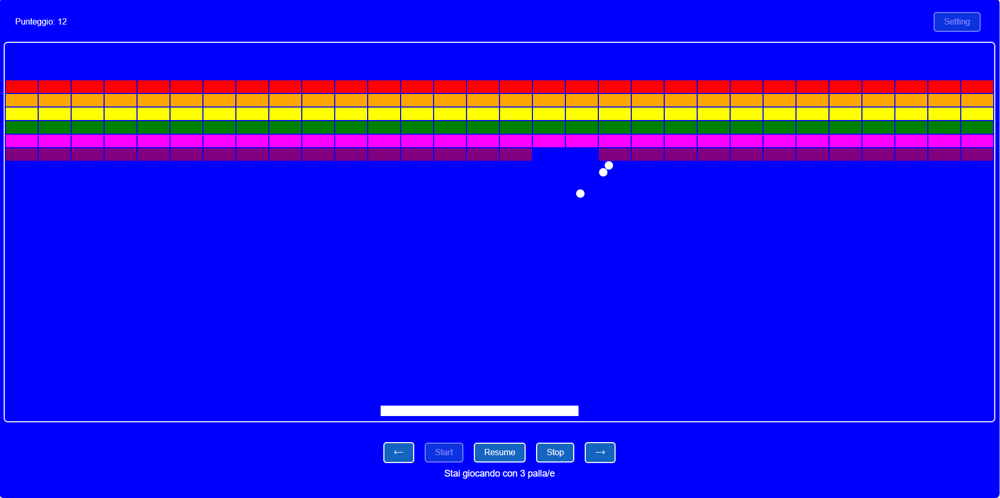

# Arkanoid WebApp

Questa è una semplice webapp in stile Arkanoid realizzata con: HTML, CSS, Canvas e JavaScript.

L'applicazione è stata creata per testare "vibe-coding" e file instructions.md con GPT-4.1.

[prompt-iniziale.md](instructions/prompt-iniziale.md) - [prompt-mattoncini.md](instructions/prompt-mattoncini.md)

La documentazione tecnica è stata redatta da: [GPT-4.1](instructions/explain-reference1.md) - [GPT-5 mini](instructions/explain-reference2.md) - [Raptor mini](instructions/explain-reference3.md)

**IMPORTANTE: Per giocare e fare in modo che la racchetta colpisca la palla il mouse deve essere all'interno del campo da gioco. Se esce dal campo da gioco puoi premere i bottoni, ma non riuscirai a controlare la racchetta.**

## Funzionalità principali
- Struttura a pagina singola (SPA)
- Suddivisione in più file JS secondo il principio SOLID (SRP)
- Ogni oggetto JS è una classe
- Gestione eventi custom tra oggetti JS
- Layout con header, campo di gioco, footer
- Popup impostazioni per numero e velocità palle
- Stato del gioco (Fermo, In corso, In pausa)
- Racchetta controllabile da mouse e bottoni
- Configurazione tramite oggetto `appConfig`
- Stili CSS dinamici e personalizzabili

## Avvio locale
1. Apri la cartella in VS Code
2. Avvia un web server leggero (es. estensione Live Server)
3. Apri `index.html` nel browser

## File principali
- `index.html` - Pagina principale
- `appConfig.js` - Configurazione
- `event-helper.js` - Gestione eventi custom
- `utils.js` - Utility varie
- `header.js` - Gestione header
- `settings-popup.js` - Popup impostazioni
- `racchetta.js` - Gestione racchetta
- `palla.js` - Gestione palla
- `campodigioco.js` - Logica campo di gioco
- `footer.js` - Gestione footer
- `app.js` - Root dell'applicazione
- `style.css` - Stili

## Note
- Tutti i file sono nella root del progetto
- Non sono usati framework o bundler
- Per modificare parametri di gioco, usa il popup "Setting"

## Autore
GitHub Copilot (GPT-4.1)
